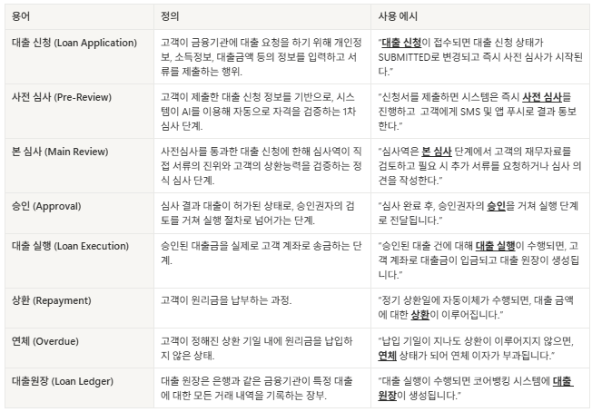
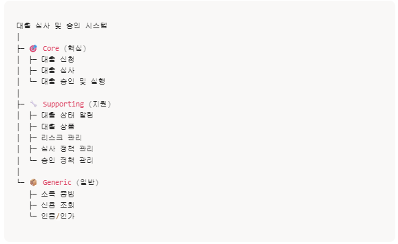
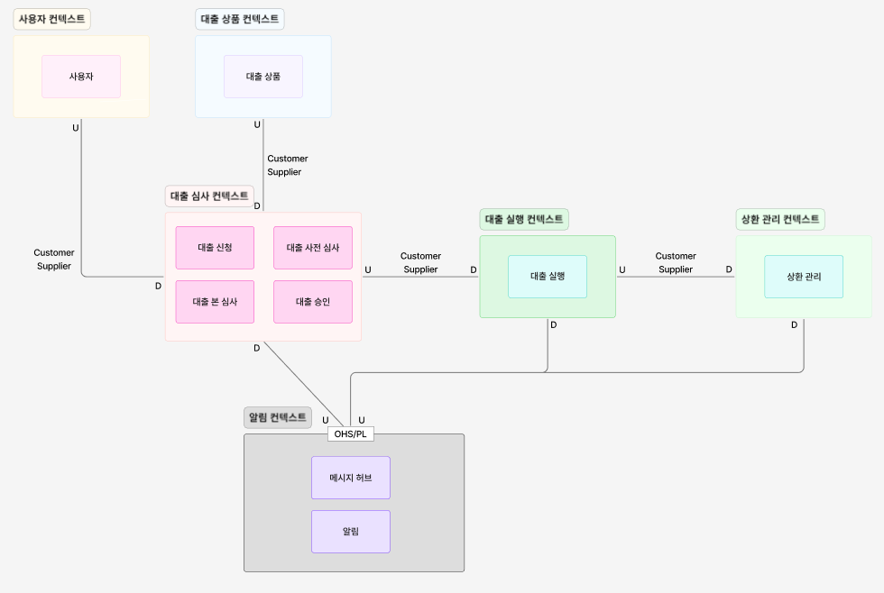

# 대출 심사 및 승인 시스템 - DDD 설계 프로젝트

> Domain-Driven Design을 적용한 대출 심사 시스템 설계 및 구현

## 📋 프로젝트 개요

본 프로젝트는 DDD(Domain-Driven Design) 방법론을 활용하여 **대출 심사 및 승인 시스템**을 설계하고 구현한 학습 프로젝트입니다.

**핵심 목표:**
- 비즈니스 도메인 언어를 코드로 명확하게 표현
- Bounded Context를 통한 명확한 경계 설정
- 도메인 모델의 일관성 있는 설계

---

## 🎯 과제 진행 현황

### STEP 1. 도메인 분석 및 언어 정의

**주요 산출물:**


- 업무 중심의 공통 언어 정의

- [업무 흐름도 (BPMN)](assignment/STEP1_BPMN.md) - 전체 업무 프로세스 다이어그램

---

### STEP 2. 경계 설정 및 구조화

**주요 산출물:**


- Subdomain 설계


- Context Map 설계
---

### STEP 3. 도메인 모델 코드 구현

**패키지 구조:**
```
src/main/java/com/example/ddd/loan/
├── preReview/           # 사전 심사 Context
│   ├── domain/
│   │   ├── entity/
│   │   │   └── PreReview.java         (Aggregate Root)
│   │   ├── vo/
│   │   │   ├── CreditInfo.java        (Value Object)
│   │   │   ├── CreditProvider.java    (Enum)
│   │   │   └── PreReviewStatus.java   (Enum)
│   │   ├── event/
│   │   │   ├── PreReviewPassedEvent.java
│   │   │   └── PreReviewFailedEvent.java
│   │   ├── repository/
│   │   │   └── PreReviewRepository.java
│   │   └── service/
│   │       └── PreReviewService.java
│   ├── application/
│   │   ├── command/
│   │   │   └── PreReviewCommand.java
│   │   ├── dto/
│   │   │   └── PreReviewResult.java
│   │   ├── port/
│   │   │   └── CreditInfoClient.java
│   │   └── service/
│   │       └── PreReviewServiceImpl.java
│   └── infrastructure/
│       ├── PreReviewJpaRepository.java
│       ├── PreReviewRepositoryImpl.java
│       └── external/
│           └── MockCreditInfoClient.java
├── mainReview/          # 본 심사 Context (구조만 정의)
├── approval/            # 승인 Context (구조만 정의)
└── application/         # 대출 신청 Context (구조만 정의)
```

---

### STEP 4. Use Case 연결 및 서비스 계층 설계

**구현된 예시 Use Case:**

#### 1️⃣ 사전 심사 시작
```java
public class PreReviewServiceImpl implements PreReviewService {
    
    @Transactional
    public PreReviewResult startPreReview(PreReviewCommand command) {
        // 1. 중복 신청 체크
        // 2. 사전 심사 생성
        PreReview preReview = PreReview.create(command.applicationId(), 
                                                command.customerId());
        
        // 3. 외부 신용정보 조회 (Port & Adapter)
        CreditInfo creditInfo = creditInfoClient.fetchCreditInfo(
            command.customerId(), CreditProvider.NICE);
        
        // 4. 신용정보 등록
        preReview.registerCreditInfo(creditInfo);
        
        // 5. 자동 심사 수행 (도메인 로직 + 이벤트 발행)
        preReview.conductAutoReview(command.age(), 
                                     command.annualIncome(), 
                                     command.dsr());
        
        // 6. 저장 (Spring Data JPA가 이벤트 자동 발행)
        return PreReviewResult.from(preReviewRepository.save(preReview));
    }
}
```

**예시 도메인 이벤트 흐름:**
```
PreReview.conductAutoReview()
    ↓
[통과] PreReviewPassedEvent 발행
    → 본심사 시스템으로 자동 전달
    
[탈락] PreReviewFailedEvent 발행
    → 알림 시스템으로 고객에게 통보
```

---

### STEP 5. 일관성 검증 및 회고

**주요 산출물:**
- [리플렉션 문서](assignment/STEP5_ReflectionDocument.md)

**핵심 설계 결정 사항:**

#### 🤔 신청-심사-승인을 왜 하나의 Context로?
- ✅ 동일한 조직(여신심사팀)이 전체를 관리
- ✅ 생명주기가 강하게 결합 (신청 없이 심사 불가)
- ✅ 용어가 일관되게 사용됨
- ❌ 억지로 나누면 네트워크 호출과 트랜잭션만 복잡해짐

#### 🤔 외부 신용 조회를 왜 별도 Context로 안 나눴나?
- ✅ 신용 조회는 "심사"의 일부 단계
- ✅ 독립적 의미 없음 (심사 없이 조회만 하지 않음)
- ✅ 중요하다고 반드시 분리하는 것은 아님
- 📦 도메인 서비스로 처리 충분

#### 🤔 알림을 왜 OHS/PL 관계로?
- ✅ 약정, 전자서명 등 **발송이 보장되어야 하는** 중요 알림
- ✅ 동기 호출로 즉시 성공/실패 확인 가능
- ❌ 이벤트 방식은 유실 가능성 존재
- ⚖️ 트레이드오프: 결합도 증가 < 발송 보장

---
### 🚀 요구사항
- JDK 17 이상
- Gradle 8.x

---

## 📄 라이센스
본 프로젝트는 학습 목적으로 작성되었습니다.
